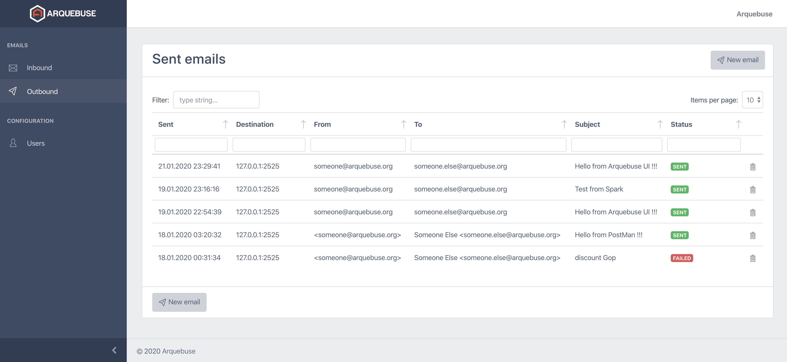

# Arquebuse

[Arquebuse](https://arquebuse.io) is an email infrastructure testing tool with a Web and command line interfaces.

With Arquebuse you can:

 * Send emails with custom headers
 * Target a specific server/port
 * Receive emails from other servers
 * Display all headers
 * Check MIME consistency
 
Arquebuse is in its early development stage. Please consult our [roadmap](https://github.com/orgs/arquebuse/projects/1) and feel free to ask for new features or report issues in the [project issues tracker](https://github.com/arquebuse/arquebuse/issues).
 
# Setup
 
For an easy setup, we publish prebuilt Docker images on [Docker Hub](https://hub.docker.com/r/arquebuse/arquebuse).
 
After [installing Docker on your system](https://docs.docker.com/get-docker/), just pull the last version of Arquebuse:
 
    docker pull arquebuse/arquebuse
    
Then, run the container with http port mapping:
 
    docker run -p 443:443 arquebuse/arquebuse
 
You'll be able to connect to the web UI with [https://localhost](https://localhost) or with your system's IP address. Note: your browser will reject the default self-signed SSL certificate. Take a look at the documentation to see how to use a custom (and valid) SSL certificate.  
 
Default credentials are **arquebuse**/**arquebuse** (you are strongly encouraged to change it).
 
To allow Arquebuse to receive emails from other computers add a mapping to Arquebuse internal SMTP server:

    docker run -p 443:443 -p 2525:2525 arquebuse/arquebuse
    
You can now send emails to Arquebuse using your system's IP address and port 2525. You can also use the standard SMTP port 25 while using argument *-p 25:2525*.

Note: it may be a bad idea to expose Arquebuse SMTP port directly on Internet as it's not designed to be bullet proof SMTP server. BTW, Arquebuse doesn't relay emails, it only stores received data into json files...

# Usage

To send new emails, go to Outbound and click on the ***New email*** button. You'll have to enter:

 * Destination: destination server or IP address and smtp port
 * From: sender email address used by SMTP protocol (can be overridden in email headers)
 * To: recipient email address used by SMTP protocol (can be overridden in email headers)
 * Data: the raw data you want to send. Data is composed of email headers and text message. Note that you must leave a blank line between headers and text message.

To view received messages, go to Inbound.

Full documentation is available on the main website: [arquebuse.io](https://arquebuse.io)